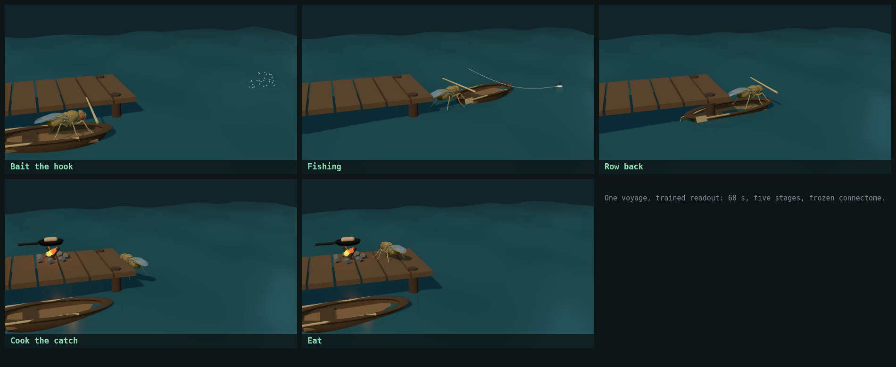
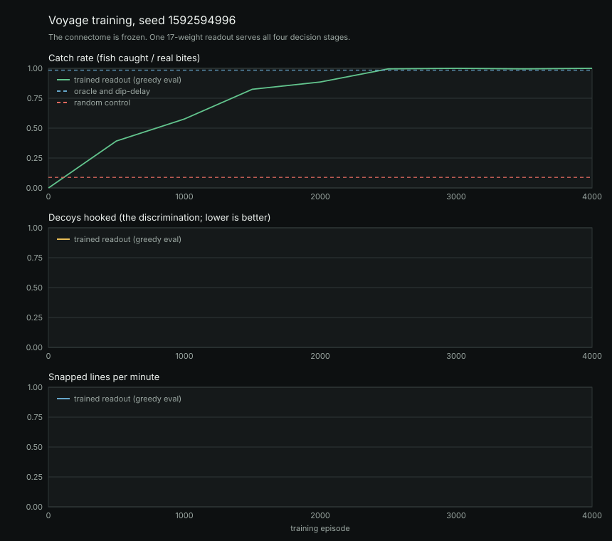

# Fly Fishing

A fruit fly connectome sits on a dock with a rod. Fish take the bait at random
times. Something has to decide when to strike.

That something is **not the fly**. This repository is a task layer on top of
[Embodied Fly Lab](https://github.com/statsleelab/embodied-fly-lab), which
couples a whole-brain FlyWire v783 spiking network to a NeuroMechFly body in
MuJoCo. This layer does not contain, modify, or reimplement any of that. It
fetches a checkout, sends a pulse down one of the simulator's existing sensory
channels, records what its descending neurons do about it, and then fits
**seventeen numbers** that turn those rates into "hook" or "wait".

## Frozen versus trained

This is the whole claim, so it goes first.

**Frozen.** The connectome. All 138,639 neurons, all 15,091,983 weighted edges,
the LIF constants, upstream's stimulus channels and its readout populations.
Nothing inside the simulator is trained, fine-tuned, adapted, or written to. The
same network, reset from the same seed, produces the same response on episode 1
and episode 600.

**Trained.** A linear readout. Seventeen weights mapping eight descending and
motor readout rates (this window and the last) plus a bias to one number, pushed
through a sigmoid, sampled as hook-or-wait, fitted by REINFORCE. They live in
`fishing/readout.mjs` and are written to `results/readout.json`. The five-stage
voyage below trains four of those readouts, one per decision stage, and is told
which stage it is in by the voyage clock — 68 numbers in total, and the section
on it says what that hand-off costs in honesty.

**The fly does not learn to fish**, or to cook, or to eat. No biological
learning happens here, and none is claimed. A policy-gradient fit learns that a particular population
firing hard means a fish is on the line, in the same sense that a logistic
regression on a thermometer learns what a fever is. The fish are a drawing.

## Demo



Five stills from one 60-second voyage under the trained readout, captured out of
the viewer itself (`tools/` has no screenshot step; these came from a headless
Chromium against `npm run preview`). The fishing panel is a frame after a catch,
which is where the splash comes from.

<!-- DEMO GIF SLOT -->
<!--
  A moving capture still to come. The viewer's own "Record 30s" button writes a
  webm via MediaRecorder; convert and drop it in here as:
      
  Suggested capture:
    1. the viewer at 1x, through two or three catches side by side
    2. the reflex panel swallowing a burnt morsel, for the red flash
    3. results/voyage-curve.svg
-->

## Run it

Needs Python 3.9+, Node 18+, npm, and about 200 MB of disk for the simulator
checkout. Nothing here calls out to a network service at run time.

```bash
python3 run.py
```

That one command fetches the simulator if it is missing, records the
descending-neuron response cache if it is missing, converts the fly body, trains
the readout, records a pair of episodes, reports the baselines, and serves the
viewer.

The steps are also available separately:

```bash
python3 run.py fetch                                # only fetch/verify the simulator
python3 run.py cache                                # re-record the response cache (slow)
python3 run.py train -- --seed 7 --episodes 1200    # only train
python3 run.py record                               # only re-record the replay pair
python3 run.py report                               # only re-run the baselines table
python3 run.py glb                                  # only convert the fly body
python3 run.py ablation                             # compare against the ablated connectomes
python3 run.py serve                                # only serve the viewer
python3 run.py build                                # build the static site
python3 run.py test                                 # the scripted layer's tests
python3 tools/fetch_sim.py --from ../embodied-fly-lab   # link an existing checkout
```

Every run is seeded. The same `--seed` reproduces the same readout, the same
learning curve and the same recorded episodes, because the network is reset from
that seed and the scripted layer draws from one seeded RNG.

**Only the cache step is slow.** It is the only thing that runs the whole-brain
network, and it takes about 40 minutes on a laptop. Training on the cache takes
under a minute, so re-training with different hyperparameters is cheap.

### Tests

```bash
node tests/task.test.mjs      # the schedule, the hook window, the re-cast, scoring
node tests/readout.test.mjs   # features, the REINFORCE update, every baseline
node tests/cache.test.mjs     # the splice, its guard rails, the ablations
```

These need no simulator checkout: they cover the scripted layer, which is where
the bugs that would silently corrupt a result live.

## The task

A bobber floats 13 units out. Things take the bait at random times, and half of
them are not fish.

| Rule | Value | Scripted or simulated |
| --- | --- | --- |
| Episode length | 60 s of brain time | scripted |
| Decision window | 50 ms | scripted |
| **Bite** (a real fish) | 150 Hz pulse on `loomHz` for 250 ms | scripted stimulus, simulated response |
| **Decoy** (a nibble) | 60 Hz pulse on `loomHz` for 250 ms | scripted stimulus, simulated response |
| Share of events that are decoys | 50% | scripted |
| Gap between events | exponential, mean 5 s, minimum 3 s | scripted |
| Hook within 500 ms of a bite | fish caught, **+1** | scripted |
| Hook on a decoy, or on nothing | line snapped, **-0.5** | scripted |
| Bite nobody hooks | **0** | scripted |
| After any hook | 1.5 s re-cast, no decisions | scripted |

Event times and spacing are redrawn every episode from an exponential with a
minimum, so there is no rhythm for a fixed-interval policy to lock onto.

**The bobber dips on a decoy too**, which is the whole point of having them. A
policy that watches the water can tell that *something* happened; only a policy
that watches the fly can tell *what*. That is what the fixed-delay-after-dip
baseline measures, and it is the score to beat.

The re-cast is what makes the reward function non-degenerate. Without it, a
coin-flip policy would hook 600 times in an episode and the scoring would be
about hook volume rather than hook timing.

## Why the raw rates, and why the looming channel

Two measurements decided the design, and both are worth stating because either
one going the other way would have made the task unwinnable.

**The bite rides on `loomHz`.** Upstream exposes seven stimulus channels. A
dose-response sweep of each against every readout population gave this for
looming input, as the raw `escape_giant_fiber` rate:

| `loomHz` in | 0 | 5 | 10 | 20 | 35 | 60 | 100 | 150 | 220 |
| --- | ---: | ---: | ---: | ---: | ---: | ---: | ---: | ---: | ---: |
| `escape_giant_fiber` out (Hz) | 0.0 | 45.5 | 67.4 | 110.1 | 134.7 | 160.0 | 177.4 | 199.0 | 218.1 |

Monotone across the whole range. Pulse amplitude survives into the readout,
which is what the decoy discrimination runs on.

**And the response is very nearly deterministic, which makes that
discrimination easy.** Measured over the sixteen recorded bite responses in the
shipped cache, the peak `escape_giant_fiber` rate is **186.1 Hz with a standard
deviation of 3.0 Hz** (range 178.7 to 192.5). The baseline rate on that same
population is exactly 0.0 Hz with zero variance, because nothing else in the
network drives it. A decoy's peak sits well clear of the bite's, and the gap is
many standard deviations wide.

So the honest reading of the decoy result below is: **the readout is thresholding
a clean, almost noise-free signal, not solving a hard perceptual
discrimination.** The network is a deterministic LIF simulation whose only
stochasticity is the Poisson input drive, and at these population sizes that
averages out. What remains genuinely non-trivial in the task is the timing (hook
inside 500 ms), not falling for the 40 Hz walking background (`walk_dnp09` has a
standard deviation of 8.95 Hz and peaks at 80.9 Hz, so it is the noisiest thing
the policy sees), and not wasting the 1.5 s re-cast.

The obvious way to make the discrimination itself hard is to draw each event's
pulse amplitude from **overlapping** ranges rather than using two fixed values,
which would put a Bayes-optimal ceiling below the oracle's. That is a named next
step, not something claimed here.

**The readout reads the raw rates, not `frame.motor`.** Upstream's normalized
motor fields divide by 35 and clamp to 1, so `motor.escape` pins at 1.0 for any
looming input above about 5 Hz and carries no amplitude information at all. The
raw rate in the table above is the same signal before that clamp. Feeding the
policy `frame.motor` would have thrown the measurement away; the sibling
repository's note that the giant fiber "saturates above roughly 30 Hz" is a
property of the clamp, not of the population.

The eight features are upstream's own readout populations: `forward_odn1`,
`walk_dnp09`, `turn_left`, `turn_right`, `reverse_mdn`, `groom_adn1`,
`escape_giant_fiber`, `feed_mn9`. The readout gets each of them for the current
window and the previous one, so a linear policy can see an onset rather than
only a level, plus a bias. Seventeen weights: 8 + 8 + 1.

A constant 40 Hz `hungerHz` walking drive runs underneath everything, so the
baseline is a fly that is doing something rather than a silent network. That is
why not hooking is a skill: `walk_dnp09` sits near 40 Hz the whole episode and
the policy has to learn to ignore it.

## How training works, and why the cache is not a shortcut

One 15 ms brain step costs 106-140 ms of wall clock on the machine this was
written on, which is about 0.11x real time. A 60 s episode is therefore about
eight minutes, and REINFORCE wants hundreds of them. Training against the live
simulator is days of compute.

So training runs against a recorded cache of descending-neuron responses. **That
cache is exact, not an approximation,** and the reason is structural:

> Hooking has no sensory consequence. The bobber, the fish and the schedule do
> not depend on what the readout decides, so the descending-activity trace an
> episode produces is independent of the policy watching it.

This is not true of most control problems, and it is the whole justification. The
cache replays real network output; it does not model it. Every number in
`results/dn-cache.json` came out of upstream's engine.

What the cache does is record four long baseline traces (70 s each, under the
walking drive alone) and sixteen bite responses (2.8 s each, from pulse onset),
then build an episode by laying responses onto a baseline at the scheduled
times. The one assumption that introduces is that a response is over before the
next bite starts. The task enforces a 3 s minimum gap against a 2.8 s recorded
response for exactly that reason, and `fishing/cache.mjs` reports the splice's
own error bar: how far each feature still is from baseline where the splice
hands back.

`python3 run.py cache` prints that residual per feature at the end of the run
and `results/baselines.json` carries it; the measured values are in the results
below.

### The update

Per decision window: `p = sigmoid(w . x)`, action sampled Bernoulli, and

```
grad = mean over decisions of (action - p) * x * advantage
```

with the advantage being the discounted reward-to-go minus a running-mean
baseline, divided by its own standard deviation. The discount (gamma 0.9, about
a one-second horizon at 50 ms windows) is not for delayed reward, since hooking
pays immediately; it is there so the policy feels the cost of the 1.5 s re-cast
a hook commits it to.

**The step is Adam, and that turned out to be load-bearing rather than
decorative.** Under a plain SGD step this task does not train at all; the
results section has the measurement and the reason.

## Results

All four policies on the same 1000 evaluation episodes, seed 1592594996:

| Policy | Catch rate | Decoys hooked | Snapped lines / min | Hook precision | Mean reward |
| --- | ---: | ---: | ---: | ---: | ---: |
| Oracle (hooks on true bites) | 100.0% | 0.0% | 0.00 | 100.0% | 5.96 |
| Trained readout (greedy) | 100.0% | 0.0% | 0.00 | 100.0% | 5.96 |
| Fixed delay after the bobber dips | 100.0% | 100.0% | 5.98 | 49.9% | 2.98 |
| Fixed interval, every 5 s | 8.9% | 8.7% | 10.47 | 4.8% | -4.71 |
| Random control (rate matched) | 4.1% | 4.1% | 4.94 | 4.6% | -2.21 |


**The trained readout matches the oracle exactly**, and it does so by telling a
bite from a decoy rather than by reacting to the bobber. One caveat carries
through every number in this table: training is bimodal, and **1 run in 5 fails
to converge at all**, scoring zero. This row is a converged run. The ablation
section below measures that rate and explains it. The comparison that
carries the claim is the third row: fixed-delay-after-dip catches every fish
too, but hooks every decoy doing it, which halves its reward. The readout
catches every fish and hooks none of the decoys.

The learning curve shows the order it learned in. Catch rate reaches 1.0 by
about episode 75, and at that point it is still hooking decoys: the decoy rate
peaks near 0.43 around episode 100 before falling to zero by episode 125. It
learns to hook first and to discriminate second, which is what the reward
structure asks for, since a missed fish costs 0 and a snapped line costs 0.5.

### How easy is this, really

Easy, and the measurement says so. Peak rates over the sixteen recorded
realizations of each event type:

| Population | Bite peak (Hz) | Decoy peak (Hz) | Baseline (Hz) | d' (bite vs decoy) |
| --- | ---: | ---: | ---: | ---: |
| `escape_giant_fiber` | 186.1 ± 3.0 | 150.4 ± 4.6 | 0.0 ± 0.0 | **9.1** |
| `reverse_mdn` | 43.3 ± 5.7 | 19.0 ± 2.9 | 0.0 ± 0.0 | **5.4** |
| `forward_odn1` | 16.9 ± 5.3 | 11.0 ± 2.3 | 2.2 ± 2.8 | 1.4 |
| `walk_dnp09` | 65.9 ± 5.4 | 61.5 ± 4.8 | 40.1 ± 8.9 | 0.8 |
| `turn_right` | 7.7 ± 1.8 | 8.9 ± 1.2 | 2.1 ± 2.2 | 0.8 |
| `turn_left` | 4.1 ± 1.2 | 3.7 ± 1.5 | 0.2 ± 0.8 | 0.3 |
| `groom_adn1` | 0.0 | 0.0 | 0.0 | - |
| `feed_mn9` | 0.0 | 0.0 | 0.0 | - |

Two populations carry essentially all of the amplitude information, and the
classes do not overlap on either. A 100% score against a nine-sigma separation
is not evidence that anything clever happened; it is evidence that the readout
found the separation, which a linear model on a separable problem should. What
the fitted weights are *not* is a claim about which population matters most:
with a margin this wide many weight vectors solve it, so the individual
magnitudes below are one solution rather than the solution.

| Feature | Weight |
| --- | ---: |
| `forward_odn1_t` | 6.65 |
| `walk_dnp09_t` | -2.41 |
| `turn_left_t` | 0.59 |
| `turn_right_t` | -3.70 |
| `reverse_mdn_t` | 6.91 |
| `escape_giant_fiber_t` | 1.40 |
| `forward_odn1_t-1` | 6.58 |
| `walk_dnp09_t-1` | -2.22 |
| `turn_left_t-1` | 2.02 |
| `turn_right_t-1` | -2.73 |
| `reverse_mdn_t-1` | 6.97 |
| `escape_giant_fiber_t-1` | 1.49 |
| `bias` | -7.58 |

_(weights under 0.1 in magnitude omitted; all 17 are in results/baselines.json)_

### What plain SGD does, and why the optimizer is Adam

Worth recording because it was the one real failure in building this. Under a
plain SGD step this task does not train at all: **600 episodes ended at a 0%
catch rate.**

The cause is feature sparsity, not the task. The bias feature is 1 in every one
of the ~1170 decision windows, while `escape_giant_fiber` is nonzero only in the
~10% of windows near a fish event. Plain SGD therefore gives the bias about ten
times the accumulated gradient, it reaches about -7 within a couple of hundred
episodes, P(hook) goes to roughly 0.001 everywhere, exploration stops, and
nothing is learned after that. The signs on every weight were already correct at
that point; none of them had any magnitude. Adam gives each weight a step scaled
by its own gradient history, and the same run then converges by episode 125.

### The splice's error bar

Splice residual for a bite, response tail minus baseline:

| Feature | Baseline (Hz) | Response tail (Hz) | Residual (Hz) |
| --- | ---: | ---: | ---: |
| `forward_odn1` | 2.16 | 1.83 | -0.34 |
| `walk_dnp09` | 40.11 | 35.74 | -4.37 |
| `turn_left` | 0.24 | 0.02 | -0.22 |
| `turn_right` | 2.1 | 1.85 | -0.25 |
| `reverse_mdn` | 0 | 0 | 0 |
| `groom_adn1` | 0 | 0 | 0 |
| `escape_giant_fiber` | 0 | 0 | 0 |
| `feed_mn9` | 0 | 0 | 0 |

Splice residual for a decoy, response tail minus baseline:

| Feature | Baseline (Hz) | Response tail (Hz) | Residual (Hz) |
| --- | ---: | ---: | ---: |
| `forward_odn1` | 2.16 | 2.5 | 0.33 |
| `walk_dnp09` | 40.11 | 38.51 | -1.6 |
| `turn_left` | 0.24 | 0.28 | 0.05 |
| `turn_right` | 2.1 | 2.62 | 0.52 |
| `reverse_mdn` | 0 | 0 | 0 |
| `groom_adn1` | 0 | 0 | 0 |
| `escape_giant_fiber` | 0 | 0 | 0 |
| `feed_mn9` | 0 | 0 | 0 |

`escape_giant_fiber` and `reverse_mdn`, the two populations that carry the
signal, return to exactly their 0 Hz baseline before the splice hands back. The
largest residual anywhere is `walk_dnp09` at -4.4 Hz against a 40.1 Hz baseline,
on the noisiest feature in the set (its own baseline standard deviation is
8.9 Hz).

**These numbers are measured on spliced cache episodes, not on live-simulator
episodes.** The argument for why that is exact rather than approximate is above;
running whole episodes against the live network to confirm it end to end is
listed as a next step and has not been done.

## Ablation: does the wiring matter?

Three caches, recorded from the same simulator through the same stimulus
channels, differing only in what was done to the connectome before upstream's
unmodified `BrainEngine` was built from it. **Weight shuffle** permutes which
weight sits on which edge, leaving every source, target and the whole multiset
of weights untouched, so total available drive is identical. **Input shuffle**
leaves the graph and weights alone and re-draws the stimulus and readout
populations as random neurons of the same count.

All three arms: the same 5 training seeds, the same schedules, and the same 1000 evaluation episodes, 600 training episodes per seed.

| Connectome | escape_giant_fiber d' | Best feature d' | Runs that converged | Catch rate | Decoys hooked | Mean reward |
| --- | ---: | ---: | ---: | ---: | ---: | ---: |
| Intact connectome | 9.15 | 9.15 | 4/5 | 100.0% | 0.0% | 5.96 |
| Weights shuffled across edges | 7.97 | 7.97 | 0/5 | - | - | - |
| Stimulus and readout populations randomized | 0.62 | 0.62 | 0/5 | - | - | - |

Catch rate, decoys hooked and mean reward are averaged over the seeds that converged. A run is counted as converged if it learned to act at all; the failure mode here is collapsing to never acting, which scores exactly zero.

Peak response per arm, bite against decoy, on the two populations that carry the signal:

| Connectome | `escape_giant_fiber` bite | decoy | `reverse_mdn` bite | decoy |
| --- | ---: | ---: | ---: | ---: |
| Intact connectome | 186.09 ± 3.02 | 150.38 ± 4.62 | 43.33 ± 5.68 | 19.02 ± 2.94 |
| Weights shuffled across edges | 80.38 ± 4.3 | 41.07 ± 5.49 | 0 ± 0 | 0 ± 0 |
| Stimulus and readout populations randomized | 16.73 ± 0.16 | 16.59 ± 0.29 | 0 ± 0 | 0 ± 0 |

### Reading this honestly

**The headline result is conditional on convergence, and one run in five does
not converge.** REINFORCE on this task is bimodal: it either finds the signal
and reaches the oracle, or it collapses to never acting and scores exactly
zero. On the intact connectome 4 of 5 seeds converge. The 100% catch rate
reported in the results section above is one of those four, and it is a fair
number for a converged run, but a single-seed table would have been reporting a
coin flip. Anywhere this repository quotes 100%, read it as "100%, in the 4 runs
out of 5 that learned to act at all".

**The weight-shuffle arm is the interesting one, and it does not say what an
ablation usually says.** The shuffled connectome still separates a bite from a
decoy nearly as well as the intact one: d' 7.97 against 9.15, with peak
`escape_giant_fiber` at 80.4 Hz for a bite and 41.1 Hz for a decoy against a
baseline of exactly zero. The information is there. The readout still never
found it, in 0 of 5 seeds.

Two explanations were tested and ruled out. It is not the lower absolute firing
rate: scaling that arm's recorded rates by 2.3x and by 4x, so the features land
where the intact arm's do, still gives 0%. It is not seed luck: five seeds, all
zero, against four of five on the intact arm. Four hyperparameter settings
(600 and 2000 episodes, learning rates 0.05, 0.15 and 0.3) also all give 0%.

So the honest conclusion is narrower than "the wiring carries the signal". It is:
**the intact network presents the signal in a form this learner reliably finds,
and the weight-shuffled one does not, even though a classifier handed the same
recordings could separate them.** One concrete difference is visible in the
table: shuffling the weights kills `reverse_mdn` outright, from 43.3 Hz down to
0.0 Hz, and the trained readout on the intact connectome puts its largest
weights on exactly that population. The intact wiring supplies a second
informative readout; the shuffled one leaves a single one.

**The input-shuffle arm is the control that says the readout is not cheating.**
With the populations randomized, d' falls to 0.62 and the bite and decoy peaks
are 16.73 Hz and 16.59 Hz: no separation survives, and nothing could learn this
from those recordings. That it also scores 0 is the expected and uninteresting
outcome, and it is there so that the weight-shuffle row has something to be
compared against.

## The voyage: five stages, and what it took to train four of them

The single-stage task above is one decision made over and over. The voyage is
the loop it sits inside: **bait the hook, fish, row back, cook the catch, eat.**
Sixty seconds, five stages, four of which take a decision.

| stage | what it is | act | good | bad | window |
| --- | --- | --- | --- | --- | --- |
| Bait the hook | 10 s | grip | `bait-firm`, touch 220 Hz | `bait-slip`, touch 60 Hz | 500 ms |
| Fishing | 25 s | hook | `bite`, loom 150 Hz | `decoy`, loom 60 Hz | 500 ms |
| Row back | 5 s | none | — | — | — |
| Cook the catch | 10 s | lift the pan | `pan-ready`, odor 145 Hz | none | 2500 ms |
| Eat | 10 s | swallow | `morsel-good`, sugar 100 Hz | `morsel-burnt`, sugar 25 Hz | 500 ms |

Two things are worth saying plainly before the numbers.

**Rowing back takes no decision.** Steering a body means closing a loop through
MuJoCo, and the cache the training runs on is only legitimate because acting has
no sensory consequence (see *why the cache is not a shortcut*). Rather than
invent a decision the simulator cannot support, the row stage is transit: the
boat moves, nothing is scored.

**The stages are chained.** How much there is to cook is how many fish were
actually landed, and how much there is to eat is how much was cooked. An empty
net means an empty pan. That is what makes it a loop rather than four tasks
stapled together, and it turned out to be the single biggest obstacle to
training it.

### Results

Five training seeds, 4000 voyages each, scored on 1000 held-out voyages.
Per-stage numbers are the fraction of that stage's rewarding events acted on.

| policy | prep | fish | cook | eat | overall | reward |
| --- | --- | --- | --- | --- | --- | --- |
| **Four readout heads** (4 x 17 weights) | 100.0% | 99.8% | 99.5% | 99.4% | **98.8%** | **6.17** |
| One shared readout (17 weights) | 100.0% | 99.8% | 100.0% | 32.5% | 90.0% | 5.30 |
| Oracle (knows every event) | 99.6% | 99.7% | 99.4% | 99.8% | 98.5% | 6.86 |
| Reflex (acts on every event, good or not) | 99.3% | 99.0% | 99.4% | 99.7% | 98.2% | 4.31 |
| Random (rate-matched) | — | — | — | — | 8.8% | −4.20 |

The reflex baseline is the voyage's version of the fixed-delay control: it acts
on everything that happens, so it matches the oracle on catch rate and loses
badly on reward, because half of what happens is a slipping bait, a decoy or a
burnt morsel. Telling those apart is the whole task, and reward is where it
shows.

**The honest caveat: eating trains on 3 of the 5 seeds and collapses to exactly
0.0% on the other 2.** It is the stage with the weakest signal and the least
data, and the 99.4% above is a converged seed. Baiting, fishing and cooking
trained on 5 of 5.

### Why the shared readout cannot eat

Both head shapes are kept, and `--heads shared` reruns the second row, because
the shared readout fails in a legible way. One weight vector that already
satisfies baiting, fishing and cooking cannot put eating's threshold where it
needs to be, and it lands on 32.5% on all five seeds — not a coin flip, a
ceiling. Four heads remove the coupling instead of fighting it.

**What that costs in honesty: the stage index is scripted.** It comes from the
voyage's clock, not from the fly. Nothing decodes which stage it is in from the
descending rates. The shared row is the one that is not told, and it is reported
next to the other for exactly that reason.

### What was actually wrong, and how it was found

The first version of this trained baiting and fishing to ceiling and left
cooking and eating at exactly 0.0%, on every seed, for 1500 voyages. A
supervised logistic fit on the same seventeen features at the same decision
moments gets 99.8% and is correct on all four stages, so the barrier was never
representation. Three separate things were wrong.

**1. Cooking was anti-learnable, not merely hard.** Every stage inherited the
bite reflex's 500 ms window without anyone checking what the network does with
each stimulus. Recorded under the same background drive, it does very different
things:

| stimulus | carrying population | peak | peaks at | above half-peak for |
| --- | --- | --- | --- | --- |
| `bait-firm` | `groom_adn1` | 104.0 Hz | 200 ms | 300 ms |
| `bite` | `escape_giant_fiber` | 184.8 Hz | 200 ms | 300 ms |
| `morsel-good` | `feed_mn9` | 66.4 Hz | 200 ms | 250 ms |
| `pan-ready` | `turn_left` | 27.1 Hz | **2150 ms** | **2750 ms** |

Three sharp transients that fit inside a 500 ms window, and one tonic response
to a 250 ms pulse. With a 500 ms window, cooking's only tell is elevated for
5.5 times as long as it pays, so acting on it loses money at any rate a random
policy explores with — and the gradient on `turn_left` correctly ran *negative*,
away from the only feature that could solve the stage. It reached −2.4 after
1500 voyages when the sign it needed was positive, at every step size and both
head shapes tried.

Cooking now gets a 2500 ms window matched to the response the network actually
produces. That is the honest reading of the task as well: a bite is a reflex and
a hot pan is a condition. The re-cast still allows one act per pan, so it buys
no free reward, only a window the signal fits inside. With it, `turn_left`
reaches +8.5 and the stage trains to 100%.

**2. Eating was a slow race, not a wall.** `feed_mn9` separates a good morsel
from a burnt one at 66.4 ± 14.0 Hz against 18.5 ± 18.9 Hz — d' 2.9, with
overlapping ranges, against fishing's 9.1. With about one rewarding chance per
voyage it takes roughly 2200 voyages for that weight to overtake the bias. The
episode budget was 1500. It is now 4000. This is also why eating is the stage
that still collapses on 2 seeds in 5: it is the one where the signal and the
data are both thin.

**3. The chain starves its own tail.** Nothing to cook unless a fish was landed,
so for the first ~200 voyages the cooking and eating stages have *no events at
all*. Those voyages are not neutral: the head still sees its 200 windows, acting
in any of them is still a mistake, and it dutifully learns the only lesson
available — never act. By the time the first pan appears it is at a bias near −6
and P(act) near 0.001, and it never recovers. Heads are now held out of a voyage
in which their stage never happened. A voyage where a stage had no events is not
a hard sample of that stage, it is an absence of it. (Dormant means no events,
not no *rewarding* events: a voyage where every bite turned out to be a decoy
did happen, and those refusals are exactly the samples that teach the
difference.)

The learning curve shows all three at once — the stages come online in chain
order, fishing and baiting by 500 voyages, cooking around 1000, eating around
2500:



### Two exploration fixes that did not work

Both are left documented in `fishing/readout.mjs` where they were attempted,
because the reason each fails is more useful than the fact that it did.

The obvious reading of "P(act) fell to 1e-4 and never came back" is that
exploration died, so put in a floor: sample from `q = (1 − e)·p + e/2`.

- **Scored against `q`** — the unbiased, textbook choice, gradient
  `(1 − e)·p·(1 − p)/q` — reintroduces the exact factor the floor was meant to
  escape. With `p` at 1e-4 the numerator is 1e-4, so however often the coin
  forces an act, the resulting update is scaled straight back down to the size
  the saturated policy would have given anyway. Unbiased, and just as stuck:
  0.0% for 1500 voyages.
- **Scored against `p`** keeps the update full size but adds a constant push
  toward acting in *every* window, and a voyage has about 1100 decision windows
  of which roughly 30 contain anything. That one was worse than doing nothing:
  0.0% on every stage, including the two that used to work.

The floor was never the problem. A uniform floor of 1% costs about −5.5 reward
per voyage in a task worth about +6, and what it mostly teaches is that acting
is a mistake — which, at random times, it is.

### Feature centring

`buildFeatures` can subtract the network's resting rate from each population,
measured from the cache's own baseline traces:

```
forward_odn1  2.16    reverse_mdn         0.00
walk_dnp09   40.11    groom_adn1          0.00
turn_left     0.24    escape_giant_fiber  0.00
turn_right    2.10    feed_mn9            0.00
```

Four of the eight rest at exactly zero. That matters more than it looks,
because the optimizer is Adam: it normalises each weight's step by that weight's
own gradient magnitude, so what reaches a weight is close to the *sign* of its
gradient rather than its size. That property is what made the single-stage task
trainable at all, and its sharp edge is that a population with a nonzero resting
rate is slightly positive in every empty window, so every act that lands in one
nudges its weight down by a consistent trickle that Adam then scales up to a
full step.

Centring is on for the voyage and off for the single-stage task, so the
committed single-stage checkpoint is untouched. It was not, on its own, enough
to rescue cooking — the window was the real problem — and it is kept because it
is the correct preprocessing either way.

### Running it

```bash
python3 run.py voyage                       # train the four heads
node fishing/train-voyage.mjs --heads shared   # the comparison row
python3 run.py record-voyage --episode 38   # write the replay pair
```

`run.py record` and `run.py record-voyage` both write
`web/public/recordings/index.json`, so whichever ran last is the demo the viewer
plays; the page takes its wording from that file's `kind`.

## What is in this commit, and what is not

Present:

- bites and decoys, the task, the scoring, the re-cast
- the five-stage voyage, its chained event counts, and per-stage scoring
- the response cache, the splice, and its measured residual per event type
- the REINFORCE readout, checkpoints, and the learning curve, in both the
  single-shared-readout and four-heads shapes
- baselines for both tasks: oracle, fixed delay after the dip, fixed interval,
  reflex, and a rate-matched random control
- the connectome ablation: weights shuffled, populations randomized
- the real NeuroMechFly body, converted to GLB, with a labelled placeholder
  when the GLB has not been generated
- the replay viewer, two recordings side by side, with the boat, the jetty and
  the fire staged per voyage stage
- live mode: the sim streams frames over a local WebSocket on a documented
  schema, and the viewer interpolates them to 60 fps

Not yet, and each is a named next step rather than a silent omission:

- **A live-sim validation column.** The results above are measured on spliced
  cache episodes. `tools/validate-cache` runs whole episodes against the live
  network, but its output is not yet a column in the results tables.
- **Overlapping pulse amplitudes.** Drawing each event's amplitude from ranges
  that overlap, instead of using two fixed values, is what would make the
  bite-versus-decoy call genuinely hard. See the determinism measurement above
  for why the current version is not.
- **A voyage ablation.** The shuffled-connectome arms were run against the
  single-stage task only. Re-running them across the five stages would say
  whether the wiring matters more for some stages than others, and the response
  time courses above suggest it should.
- **The demo recording.** The slot near the top of this file is still empty.

## The fly model

`tools/build_fly_glb.py` converts the NeuroMechFly body out of the fetched
checkout into one glTF binary:

```bash
python3 tools/build_fly_glb.py     # reads vendor/, writes web/public/fly.glb
```

It parses `assets/model/fly.xml` (68 bodies, 66 hinges, 69 mesh geoms), loads
the 39 binary STLs, applies each declared mesh scale (thirty of the meshes are
mirrored, so their winding is flipped back), welds vertices, recomputes smooth
normals, and writes a node tree that mirrors the MJCF body tree. No third-party
Python package is involved.

The rig goes in the glTF's `extras` rather than a skin, because this is a
rigid-body tree and not a skinned mesh. Each hinge records the node it turns,
its axis, its neutral angle and the control index that drives it, so the viewer
can do forward kinematics without a physics engine. The converter derives qpos
addresses by walking the tree and **checks that derivation against the actuator
table for all 42 actuated joints** before trusting it for the 24 passive ones.

**`web/public/fly.glb` is gitignored.** It is geometry converted from a
repository that ships no LICENSE, so it is generated locally and never
committed, exactly like the response cache. The viewer treats its absence as
normal: without it you get a labelled placeholder capsule, and the HUD says
which body is on screen. A static deploy that wants the real body has to run the
converter as part of its build, from its own checkout.

**The legs are at the model's neutral pose.** Upstream's CPG could drive them
and the rig carries everything needed for that, but a fly sitting on a dock
holding a rod is not walking, and animating a gait it is not performing would be
drawing behaviour rather than showing it. The idle sway is scripted and labelled.

## The viewer

`web/` is a Vite + TypeScript app. `three` comes from npm; there is no CDN and no
external network call at build or run time.

```bash
cd web && npm install
npm run dev      # replay mode on localhost
npm run build    # static site in web/dist
```

Replay mode needs no backend at all, so `web/dist` deploys to Vercel (or any
static host) as it is. Set the project root to `web/`, the build command to
`npm run build`, and the output directory to `dist`.

Two recordings play side by side off one episode clock, because both were made
from the same bite schedule. The difference between the panels is the policy and
nothing else.

Each panel carries its own camera and capture controls:

- **Orbit** (the default) frames the dock and the bobber together.
- **Close-up** puts the orbit target on the fly and tightens the distance
  limits around it. Both modes keep the orbit controls live, so close-up means
  the camera sits on the fly, not that you lose control of it.
- **Record 30s** captures that panel's canvas with MediaRecorder and hands you a
  `.webm`. It records the canvas's own `captureStream`, so the file is exactly
  what was on screen rather than a second render path that could disagree with
  it. Click again to stop early. On a browser with no webm encoder the button
  disables itself and says so; the rest of the viewer does not depend on it.

### The replay format

`fishing/record.mjs` writes it; `web/src/types.ts` is its machine-readable
definition. Schema version 1:

```jsonc
{
  "schemaVersion": 2,
  "kind": "fly-fishing-replay",
  "policy": "readoutGreedy",        // or "random"
  "label": "Trained readout",
  "seed": 3109511962,
  "windowMs": 50,                   // one frame is one decision window
  "episodeMs": 60000,
  "summary": { "bites": 7, "decoys": 6, "caught": 7, "decoysHooked": 1, "snapped": 1, "...": "..." },
  "events":   [{ "tMs": 3856, "type": "bite" }],    // or "decoy"
  "outcomes": [{ "tMs": 3950, "type": "catch" },
               { "tMs": 9910, "type": "snap", "onDecoy": true }],
  "frames": {                       // columnar, one entry per window
    "escapeHz": [0, 107.4, 159.8],  // raw escape_giant_fiber, simulated
    "walkHz":   [39.5, 38.1, 40.2], // raw walk_dnp09, simulated
    "pHook":    [0.004, 0.03, 0.45],// the readout's P(hook), null if it has none
    "bobber":   [0, 0.4, 1]         // dip, 0 floating to 1 under; scripted
  },
  "provenance": { "simulated": ["..."], "scripted": ["..."], "frozen": "...", "trained": "..." }
}
```

`onDecoy` separates the two kinds of snapped line: falling for a decoy is the
discrimination failing, and snapping on empty water is not.

The viewer samples that 20 Hz grid and interpolates the bobber between windows,
so it renders smoothly at whatever frame rate the browser gives it.

## Scripted versus simulated

**Simulated** (upstream's whole-brain LIF network, unmodified, driven through its
own stimulus channels):

- every descending and motor readout rate the policy sees or the HUD prints
- the response to the bite pulse, from the looming visual proxy through to the
  giant-fiber population

**Scripted** (this repository, plain code, no neural component anywhere in it):

- the fishing task: the schedule, the hook window, the re-cast, all scoring
- the mapping from "a fish bit" to a 150 Hz pulse on `loomHz`
- every baseline, including the oracle and the rate-matched random control
- the bobber track, the dock, the water, the fly's position, and the placeholder
  body in the viewer
- the splice that assembles an episode from recorded responses

**Trained** (this repository): seventeen readout weights, by REINFORCE.

`results/readout.json` and every recording restate this split in their own
`frozen` / `trained` / `provenance` fields, so a stray copy of either file cannot
be mistaken for a measurement.

## No biological validity

Nothing here measures a fruit fly.

The simulator's own README is explicit that it is an interactive research
prototype and not a biologically validated digital animal: its visual input is a
looming-population proxy rather than a photoreceptor model, and its sensor and
descending-neuron transforms are designed interfaces. Every number this layer
produces inherits all of that, and then adds a scripted game and a fitted
readout on top.

A catch rate here is a property of this code. It says nothing about
*Drosophila*, about connectomics, or about what a real fly would do.

## Credits and licenses

This layer is MIT licensed (`LICENSE`). It bundles nothing.

**The upstream simulator ships no LICENSE file**, so no redistribution rights are
granted for it, and this repository therefore never vendors it: the fetch script
clones your own checkout into a gitignored `vendor/`, and no upstream code or
connectome data is committed here. The response cache recorded from it is
gitignored for the same reason.

| Component | License | Verified |
| --- | --- | --- |
| [Embodied Fly Lab](https://github.com/statsleelab/embodied-fly-lab) | no LICENSE file present; fetched, never redistributed | Yes, checked directly |
| [MuJoCo](https://github.com/google-deepmind/mujoco) | Apache-2.0 | Yes |
| [FlyGym / NeuroMechFly v2](https://github.com/NeLy-EPFL/flygym) | Apache-2.0 | Yes |
| [Three.js](https://github.com/mrdoob/three.js) | MIT | Yes, the npm package declares it |
| [Vite](https://github.com/vitejs/vite) | MIT | Yes, the npm package declares it |
| [TypeScript](https://github.com/microsoft/TypeScript) | Apache-2.0 | Yes, the npm package declares it |
| [FlyWire](https://flywire.ai/) FAFB v783 connectome | reported CC BY 4.0, citation required | **No**, see below |
| [Eon fly-brain](https://github.com/eonsystemspbc/fly-brain) | GPL-2.0-or-later | Inherited from upstream's PROVENANCE.md |
| [Drosophila_brain_model](https://github.com/philshiu/Drosophila_brain_model) | MIT | Inherited from upstream's PROVENANCE.md |

Work using the connectome should cite Dorkenwald *et al.* (2024), Schlegel
*et al.* (2024), Matsliah *et al.* (2024), and Zheng *et al.* (2018); the body
and framework, Wang-Chen *et al.* (NeuroMechFly v2); the physics runtime,
Todorov *et al.* (MuJoCo).

Full attribution, verification state for each license claim, and full citations
are in [PROVENANCE.md](PROVENANCE.md). One claim there is explicitly marked
unverified: the FlyWire terms page was unreachable from the environment the
sibling repository was written in, so its license is recorded as reported rather
than as checked.

This repository is a sibling of
[fly-nomad-games](https://github.com/Lameda12/fly-nomad-games) and follows its
structure, its fetch-never-vendor rule, and its habit of saying which half of a
number is scripted.
