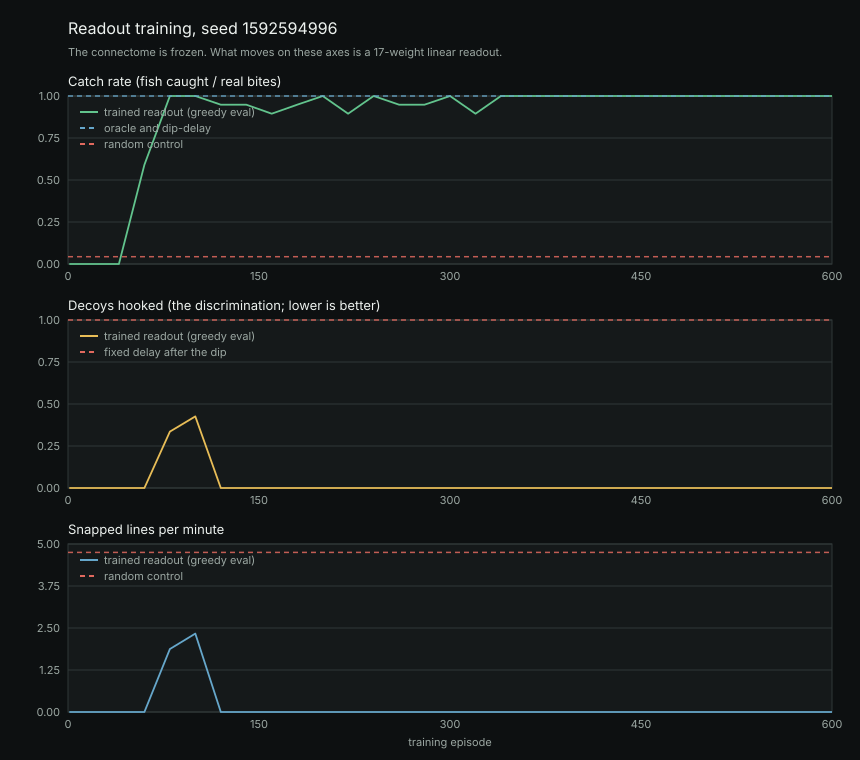

# Fly Fishing

A fruit fly connectome sits on a dock with a rod. Fish take the bait at random
times. Something has to decide when to strike.

That something is **not the fly**. This repository is a task layer on top of
[Embodied Fly Lab](https://github.com/statsleelab/embodied-fly-lab), which
couples a whole-brain FlyWire v783 spiking network to a NeuroMechFly body in
MuJoCo. This layer does not contain, modify, or reimplement any of that. It
fetches a checkout, sends a pulse down one of the simulator's existing sensory
channels, records what its descending neurons do about it, and then fits
**seventeen numbers** that turn those rates into "hook" or "wait".

## Frozen versus trained

This is the whole claim, so it goes first.

**Frozen.** The connectome. All 138,639 neurons, all 15,091,983 weighted edges,
the LIF constants, upstream's stimulus channels and its readout populations.
Nothing inside the simulator is trained, fine-tuned, adapted, or written to. The
same network, reset from the same seed, produces the same response on episode 1
and episode 600.

**Trained.** A linear readout. Seventeen weights mapping eight descending and
motor readout rates (this window and the last) plus a bias to one number, pushed
through a sigmoid, sampled as hook-or-wait, fitted by REINFORCE. They live in
`fishing/readout.mjs` and are written to `results/readout.json`.

**The fly does not learn to fish.** No biological learning happens here, and
none is claimed. A policy-gradient fit learns that a particular population
firing hard means a fish is on the line, in the same sense that a logistic
regression on a thermometer learns what a fever is. The fish are a drawing.

## Demo

<!-- DEMO GIF SLOT -->
<!--
  Drop the recording in here, replacing the line below:
      
  Suggested capture:
    1. the viewer at 1x, through two or three catches side by side
    2. the random panel snapping a line, for the red flash
    3. results/learning-curve.svg
-->

_Demo recording not captured yet. See the slot above._

## Run it

Needs Python 3.9+, Node 18+, npm, and about 200 MB of disk for the simulator
checkout. Nothing here calls out to a network service at run time.

```bash
python3 run.py
```

That one command fetches the simulator if it is missing, records the
descending-neuron response cache if it is missing, converts the fly body, trains
the readout, records a pair of episodes, reports the baselines, and serves the
viewer.

The steps are also available separately:

```bash
python3 run.py fetch                                # only fetch/verify the simulator
python3 run.py cache                                # re-record the response cache (slow)
python3 run.py train -- --seed 7 --episodes 1200    # only train
python3 run.py record                               # only re-record the replay pair
python3 run.py report                               # only re-run the baselines table
python3 run.py glb                                  # only convert the fly body
python3 run.py serve                                # only serve the viewer
python3 run.py build                                # build the static site
python3 run.py test                                 # the scripted layer's tests
python3 tools/fetch_sim.py --from ../embodied-fly-lab   # link an existing checkout
```

Every run is seeded. The same `--seed` reproduces the same readout, the same
learning curve and the same recorded episodes, because the network is reset from
that seed and the scripted layer draws from one seeded RNG.

**Only the cache step is slow.** It is the only thing that runs the whole-brain
network, and it takes about 40 minutes on a laptop. Training on the cache takes
under a minute, so re-training with different hyperparameters is cheap.

### Tests

```bash
node tests/task.test.mjs      # the schedule, the hook window, the re-cast, scoring
node tests/readout.test.mjs   # features, the REINFORCE update, every baseline
node tests/cache.test.mjs     # the splice, its guard rails, the ablations
```

These need no simulator checkout: they cover the scripted layer, which is where
the bugs that would silently corrupt a result live.

## The task

A bobber floats 13 units out. Things take the bait at random times, and half of
them are not fish.

| Rule | Value | Scripted or simulated |
| --- | --- | --- |
| Episode length | 60 s of brain time | scripted |
| Decision window | 50 ms | scripted |
| **Bite** (a real fish) | 150 Hz pulse on `loomHz` for 250 ms | scripted stimulus, simulated response |
| **Decoy** (a nibble) | 60 Hz pulse on `loomHz` for 250 ms | scripted stimulus, simulated response |
| Share of events that are decoys | 50% | scripted |
| Gap between events | exponential, mean 5 s, minimum 3 s | scripted |
| Hook within 500 ms of a bite | fish caught, **+1** | scripted |
| Hook on a decoy, or on nothing | line snapped, **-0.5** | scripted |
| Bite nobody hooks | **0** | scripted |
| After any hook | 1.5 s re-cast, no decisions | scripted |

Event times and spacing are redrawn every episode from an exponential with a
minimum, so there is no rhythm for a fixed-interval policy to lock onto.

**The bobber dips on a decoy too**, which is the whole point of having them. A
policy that watches the water can tell that *something* happened; only a policy
that watches the fly can tell *what*. That is what the fixed-delay-after-dip
baseline measures, and it is the score to beat.

The re-cast is what makes the reward function non-degenerate. Without it, a
coin-flip policy would hook 600 times in an episode and the scoring would be
about hook volume rather than hook timing.

## Why the raw rates, and why the looming channel

Two measurements decided the design, and both are worth stating because either
one going the other way would have made the task unwinnable.

**The bite rides on `loomHz`.** Upstream exposes seven stimulus channels. A
dose-response sweep of each against every readout population gave this for
looming input, as the raw `escape_giant_fiber` rate:

| `loomHz` in | 0 | 5 | 10 | 20 | 35 | 60 | 100 | 150 | 220 |
| --- | ---: | ---: | ---: | ---: | ---: | ---: | ---: | ---: | ---: |
| `escape_giant_fiber` out (Hz) | 0.0 | 45.5 | 67.4 | 110.1 | 134.7 | 160.0 | 177.4 | 199.0 | 218.1 |

Monotone across the whole range. Pulse amplitude survives into the readout,
which is what the decoy discrimination runs on.

**And the response is very nearly deterministic, which makes that
discrimination easy.** Measured over the sixteen recorded bite responses in the
shipped cache, the peak `escape_giant_fiber` rate is **186.1 Hz with a standard
deviation of 3.0 Hz** (range 178.7 to 192.5). The baseline rate on that same
population is exactly 0.0 Hz with zero variance, because nothing else in the
network drives it. A decoy's peak sits well clear of the bite's, and the gap is
many standard deviations wide.

So the honest reading of the decoy result below is: **the readout is thresholding
a clean, almost noise-free signal, not solving a hard perceptual
discrimination.** The network is a deterministic LIF simulation whose only
stochasticity is the Poisson input drive, and at these population sizes that
averages out. What remains genuinely non-trivial in the task is the timing (hook
inside 500 ms), not falling for the 40 Hz walking background (`walk_dnp09` has a
standard deviation of 8.95 Hz and peaks at 80.9 Hz, so it is the noisiest thing
the policy sees), and not wasting the 1.5 s re-cast.

The obvious way to make the discrimination itself hard is to draw each event's
pulse amplitude from **overlapping** ranges rather than using two fixed values,
which would put a Bayes-optimal ceiling below the oracle's. That is a named next
step, not something claimed here.

**The readout reads the raw rates, not `frame.motor`.** Upstream's normalized
motor fields divide by 35 and clamp to 1, so `motor.escape` pins at 1.0 for any
looming input above about 5 Hz and carries no amplitude information at all. The
raw rate in the table above is the same signal before that clamp. Feeding the
policy `frame.motor` would have thrown the measurement away; the sibling
repository's note that the giant fiber "saturates above roughly 30 Hz" is a
property of the clamp, not of the population.

The eight features are upstream's own readout populations: `forward_odn1`,
`walk_dnp09`, `turn_left`, `turn_right`, `reverse_mdn`, `groom_adn1`,
`escape_giant_fiber`, `feed_mn9`. The readout gets each of them for the current
window and the previous one, so a linear policy can see an onset rather than
only a level, plus a bias. Seventeen weights: 8 + 8 + 1.

A constant 40 Hz `hungerHz` walking drive runs underneath everything, so the
baseline is a fly that is doing something rather than a silent network. That is
why not hooking is a skill: `walk_dnp09` sits near 40 Hz the whole episode and
the policy has to learn to ignore it.

## How training works, and why the cache is not a shortcut

One 15 ms brain step costs 106-140 ms of wall clock on the machine this was
written on, which is about 0.11x real time. A 60 s episode is therefore about
eight minutes, and REINFORCE wants hundreds of them. Training against the live
simulator is days of compute.

So training runs against a recorded cache of descending-neuron responses. **That
cache is exact, not an approximation,** and the reason is structural:

> Hooking has no sensory consequence. The bobber, the fish and the schedule do
> not depend on what the readout decides, so the descending-activity trace an
> episode produces is independent of the policy watching it.

This is not true of most control problems, and it is the whole justification. The
cache replays real network output; it does not model it. Every number in
`results/dn-cache.json` came out of upstream's engine.

What the cache does is record four long baseline traces (70 s each, under the
walking drive alone) and sixteen bite responses (2.8 s each, from pulse onset),
then build an episode by laying responses onto a baseline at the scheduled
times. The one assumption that introduces is that a response is over before the
next bite starts. The task enforces a 3 s minimum gap against a 2.8 s recorded
response for exactly that reason, and `fishing/cache.mjs` reports the splice's
own error bar: how far each feature still is from baseline where the splice
hands back.

`python3 run.py cache` prints that residual per feature at the end of the run
and `results/baselines.json` carries it; the measured values are in the results
below.

### The update

Per decision window: `p = sigmoid(w . x)`, action sampled Bernoulli, and

```
grad = mean over decisions of (action - p) * x * advantage
```

with the advantage being the discounted reward-to-go minus a running-mean
baseline, divided by its own standard deviation. The discount (gamma 0.9, about
a one-second horizon at 50 ms windows) is not for delayed reward, since hooking
pays immediately; it is there so the policy feels the cost of the 1.5 s re-cast
a hook commits it to.

**The step is Adam, and that turned out to be load-bearing rather than
decorative.** Under a plain SGD step this task does not train at all; the
results section has the measurement and the reason.

## Results

All four policies on the same 1000 evaluation episodes, seed 1592594996:

| Policy | Catch rate | Decoys hooked | Snapped lines / min | Hook precision | Mean reward |
| --- | ---: | ---: | ---: | ---: | ---: |
| Oracle (hooks on true bites) | 100.0% | 0.0% | 0.00 | 100.0% | 5.96 |
| Trained readout (greedy) | 100.0% | 0.0% | 0.00 | 100.0% | 5.96 |
| Fixed delay after the bobber dips | 100.0% | 100.0% | 5.98 | 49.9% | 2.98 |
| Fixed interval, every 5 s | 8.9% | 8.7% | 10.47 | 4.8% | -4.71 |
| Random control (rate matched) | 4.1% | 4.1% | 4.94 | 4.6% | -2.21 |



**The trained readout matches the oracle exactly**, and it does so by telling a
bite from a decoy rather than by reacting to the bobber. The comparison that
carries the claim is the third row: fixed-delay-after-dip catches every fish
too, but hooks every decoy doing it, which halves its reward. The readout
catches every fish and hooks none of the decoys.

The learning curve shows the order it learned in. Catch rate reaches 1.0 by
about episode 75, and at that point it is still hooking decoys: the decoy rate
peaks near 0.43 around episode 100 before falling to zero by episode 125. It
learns to hook first and to discriminate second, which is what the reward
structure asks for, since a missed fish costs 0 and a snapped line costs 0.5.

### How easy is this, really

Easy, and the measurement says so. Peak rates over the sixteen recorded
realizations of each event type:

| Population | Bite peak (Hz) | Decoy peak (Hz) | Baseline (Hz) | d' (bite vs decoy) |
| --- | ---: | ---: | ---: | ---: |
| `escape_giant_fiber` | 186.1 ± 3.0 | 150.4 ± 4.6 | 0.0 ± 0.0 | **9.1** |
| `reverse_mdn` | 43.3 ± 5.7 | 19.0 ± 2.9 | 0.0 ± 0.0 | **5.4** |
| `forward_odn1` | 16.9 ± 5.3 | 11.0 ± 2.3 | 2.2 ± 2.8 | 1.4 |
| `walk_dnp09` | 65.9 ± 5.4 | 61.5 ± 4.8 | 40.1 ± 8.9 | 0.8 |
| `turn_right` | 7.7 ± 1.8 | 8.9 ± 1.2 | 2.1 ± 2.2 | 0.8 |
| `turn_left` | 4.1 ± 1.2 | 3.7 ± 1.5 | 0.2 ± 0.8 | 0.3 |
| `groom_adn1` | 0.0 | 0.0 | 0.0 | - |
| `feed_mn9` | 0.0 | 0.0 | 0.0 | - |

Two populations carry essentially all of the amplitude information, and the
classes do not overlap on either. A 100% score against a nine-sigma separation
is not evidence that anything clever happened; it is evidence that the readout
found the separation, which a linear model on a separable problem should. What
the fitted weights are *not* is a claim about which population matters most:
with a margin this wide many weight vectors solve it, so the individual
magnitudes below are one solution rather than the solution.

| Feature | Weight |
| --- | ---: |
| `forward_odn1_t` | 6.65 |
| `walk_dnp09_t` | -2.41 |
| `turn_left_t` | 0.59 |
| `turn_right_t` | -3.70 |
| `reverse_mdn_t` | 6.91 |
| `escape_giant_fiber_t` | 1.40 |
| `forward_odn1_t-1` | 6.58 |
| `walk_dnp09_t-1` | -2.22 |
| `turn_left_t-1` | 2.02 |
| `turn_right_t-1` | -2.73 |
| `reverse_mdn_t-1` | 6.97 |
| `escape_giant_fiber_t-1` | 1.49 |
| `bias` | -7.58 |

_(weights under 0.1 in magnitude omitted; all 17 are in results/baselines.json)_

### What plain SGD does, and why the optimizer is Adam

Worth recording because it was the one real failure in building this. Under a
plain SGD step this task does not train at all: **600 episodes ended at a 0%
catch rate.**

The cause is feature sparsity, not the task. The bias feature is 1 in every one
of the ~1170 decision windows, while `escape_giant_fiber` is nonzero only in the
~10% of windows near a fish event. Plain SGD therefore gives the bias about ten
times the accumulated gradient, it reaches about -7 within a couple of hundred
episodes, P(hook) goes to roughly 0.001 everywhere, exploration stops, and
nothing is learned after that. The signs on every weight were already correct at
that point; none of them had any magnitude. Adam gives each weight a step scaled
by its own gradient history, and the same run then converges by episode 125.

### The splice's error bar

Splice residual for a bite, response tail minus baseline:

| Feature | Baseline (Hz) | Response tail (Hz) | Residual (Hz) |
| --- | ---: | ---: | ---: |
| `forward_odn1` | 2.16 | 1.83 | -0.34 |
| `walk_dnp09` | 40.11 | 35.74 | -4.37 |
| `turn_left` | 0.24 | 0.02 | -0.22 |
| `turn_right` | 2.1 | 1.85 | -0.25 |
| `reverse_mdn` | 0 | 0 | 0 |
| `groom_adn1` | 0 | 0 | 0 |
| `escape_giant_fiber` | 0 | 0 | 0 |
| `feed_mn9` | 0 | 0 | 0 |

Splice residual for a decoy, response tail minus baseline:

| Feature | Baseline (Hz) | Response tail (Hz) | Residual (Hz) |
| --- | ---: | ---: | ---: |
| `forward_odn1` | 2.16 | 2.5 | 0.33 |
| `walk_dnp09` | 40.11 | 38.51 | -1.6 |
| `turn_left` | 0.24 | 0.28 | 0.05 |
| `turn_right` | 2.1 | 2.62 | 0.52 |
| `reverse_mdn` | 0 | 0 | 0 |
| `groom_adn1` | 0 | 0 | 0 |
| `escape_giant_fiber` | 0 | 0 | 0 |
| `feed_mn9` | 0 | 0 | 0 |

`escape_giant_fiber` and `reverse_mdn`, the two populations that carry the
signal, return to exactly their 0 Hz baseline before the splice hands back. The
largest residual anywhere is `walk_dnp09` at -4.4 Hz against a 40.1 Hz baseline,
on the noisiest feature in the set (its own baseline standard deviation is
8.9 Hz).

**These numbers are measured on spliced cache episodes, not on live-simulator
episodes.** The argument for why that is exact rather than approximate is above;
running whole episodes against the live network to confirm it end to end is
listed as a next step and has not been done.

## What is in this commit, and what is not

Present:

- bites and decoys, the task, the scoring, the re-cast
- the response cache, the splice, and its measured residual per event type
- the REINFORCE readout, checkpoints, and the learning curve
- four baselines: oracle, fixed delay after the dip, fixed interval, and a
  rate-matched random control
- the real NeuroMechFly body, converted to GLB, with a labelled placeholder
  when the GLB has not been generated
- the replay viewer, two recordings side by side

Not yet, and each is a named next step rather than a silent omission:

- **Live mode.** A WebSocket from the Python side, with a documented schema.
  Replay mode is all that ships here, which is also what lets `web/` deploy as a
  static site with no backend.
- **A close-up camera and the webm export.** The viewer has orbit controls and a
  shared transport; the follow camera and the one-click MediaRecorder capture
  are not built.
- **The ablation results.** Both ablations (`--ablation weight-shuffle`,
  `--ablation input-shuffle`) are implemented in `fishing/brain-host.mjs` and
  unit tested, and each needs its own recorded cache. No ablation number is
  claimed until those runs exist.
- **A live-sim validation column.** The results above are measured on spliced
  cache episodes. Running whole episodes against the live network to confirm the
  splice end to end is the check that has not been done yet.
- **Overlapping pulse amplitudes.** Drawing each event's amplitude from ranges
  that overlap, instead of using two fixed values, is what would make the
  bite-versus-decoy call genuinely hard. See the determinism measurement above
  for why the current version is not.

## The fly model

`tools/build_fly_glb.py` converts the NeuroMechFly body out of the fetched
checkout into one glTF binary:

```bash
python3 tools/build_fly_glb.py     # reads vendor/, writes web/public/fly.glb
```

It parses `assets/model/fly.xml` (68 bodies, 66 hinges, 69 mesh geoms), loads
the 39 binary STLs, applies each declared mesh scale (thirty of the meshes are
mirrored, so their winding is flipped back), welds vertices, recomputes smooth
normals, and writes a node tree that mirrors the MJCF body tree. No third-party
Python package is involved.

The rig goes in the glTF's `extras` rather than a skin, because this is a
rigid-body tree and not a skinned mesh. Each hinge records the node it turns,
its axis, its neutral angle and the control index that drives it, so the viewer
can do forward kinematics without a physics engine. The converter derives qpos
addresses by walking the tree and **checks that derivation against the actuator
table for all 42 actuated joints** before trusting it for the 24 passive ones.

**`web/public/fly.glb` is gitignored.** It is geometry converted from a
repository that ships no LICENSE, so it is generated locally and never
committed, exactly like the response cache. The viewer treats its absence as
normal: without it you get a labelled placeholder capsule, and the HUD says
which body is on screen. A static deploy that wants the real body has to run the
converter as part of its build, from its own checkout.

**The legs are at the model's neutral pose.** Upstream's CPG could drive them
and the rig carries everything needed for that, but a fly sitting on a dock
holding a rod is not walking, and animating a gait it is not performing would be
drawing behaviour rather than showing it. The idle sway is scripted and labelled.

## The viewer

`web/` is a Vite + TypeScript app. `three` comes from npm; there is no CDN and no
external network call at build or run time.

```bash
cd web && npm install
npm run dev      # replay mode on localhost
npm run build    # static site in web/dist
```

Replay mode needs no backend at all, so `web/dist` deploys to Vercel (or any
static host) as it is. Set the project root to `web/`, the build command to
`npm run build`, and the output directory to `dist`.

Two recordings play side by side off one episode clock, because both were made
from the same bite schedule. The difference between the panels is the policy and
nothing else.

### The replay format

`fishing/record.mjs` writes it; `web/src/types.ts` is its machine-readable
definition. Schema version 1:

```jsonc
{
  "schemaVersion": 2,
  "kind": "fly-fishing-replay",
  "policy": "readoutGreedy",        // or "random"
  "label": "Trained readout",
  "seed": 3109511962,
  "windowMs": 50,                   // one frame is one decision window
  "episodeMs": 60000,
  "summary": { "bites": 7, "decoys": 6, "caught": 7, "decoysHooked": 1, "snapped": 1, "...": "..." },
  "events":   [{ "tMs": 3856, "type": "bite" }],    // or "decoy"
  "outcomes": [{ "tMs": 3950, "type": "catch" },
               { "tMs": 9910, "type": "snap", "onDecoy": true }],
  "frames": {                       // columnar, one entry per window
    "escapeHz": [0, 107.4, 159.8],  // raw escape_giant_fiber, simulated
    "walkHz":   [39.5, 38.1, 40.2], // raw walk_dnp09, simulated
    "pHook":    [0.004, 0.03, 0.45],// the readout's P(hook), null if it has none
    "bobber":   [0, 0.4, 1]         // dip, 0 floating to 1 under; scripted
  },
  "provenance": { "simulated": ["..."], "scripted": ["..."], "frozen": "...", "trained": "..." }
}
```

`onDecoy` separates the two kinds of snapped line: falling for a decoy is the
discrimination failing, and snapping on empty water is not.

The viewer samples that 20 Hz grid and interpolates the bobber between windows,
so it renders smoothly at whatever frame rate the browser gives it.

## Scripted versus simulated

**Simulated** (upstream's whole-brain LIF network, unmodified, driven through its
own stimulus channels):

- every descending and motor readout rate the policy sees or the HUD prints
- the response to the bite pulse, from the looming visual proxy through to the
  giant-fiber population

**Scripted** (this repository, plain code, no neural component anywhere in it):

- the fishing task: the schedule, the hook window, the re-cast, all scoring
- the mapping from "a fish bit" to a 150 Hz pulse on `loomHz`
- every baseline, including the oracle and the rate-matched random control
- the bobber track, the dock, the water, the fly's position, and the placeholder
  body in the viewer
- the splice that assembles an episode from recorded responses

**Trained** (this repository): seventeen readout weights, by REINFORCE.

`results/readout.json` and every recording restate this split in their own
`frozen` / `trained` / `provenance` fields, so a stray copy of either file cannot
be mistaken for a measurement.

## No biological validity

Nothing here measures a fruit fly.

The simulator's own README is explicit that it is an interactive research
prototype and not a biologically validated digital animal: its visual input is a
looming-population proxy rather than a photoreceptor model, and its sensor and
descending-neuron transforms are designed interfaces. Every number this layer
produces inherits all of that, and then adds a scripted game and a fitted
readout on top.

A catch rate here is a property of this code. It says nothing about
*Drosophila*, about connectomics, or about what a real fly would do.

## Credits and licenses

This layer is MIT licensed (`LICENSE`). It bundles nothing.

**The upstream simulator ships no LICENSE file**, so no redistribution rights are
granted for it, and this repository therefore never vendors it: the fetch script
clones your own checkout into a gitignored `vendor/`, and no upstream code or
connectome data is committed here. The response cache recorded from it is
gitignored for the same reason.

| Component | License | Verified |
| --- | --- | --- |
| [Embodied Fly Lab](https://github.com/statsleelab/embodied-fly-lab) | no LICENSE file present; fetched, never redistributed | Yes, checked directly |
| [MuJoCo](https://github.com/google-deepmind/mujoco) | Apache-2.0 | Yes |
| [FlyGym / NeuroMechFly v2](https://github.com/NeLy-EPFL/flygym) | Apache-2.0 | Yes |
| [Three.js](https://github.com/mrdoob/three.js) | MIT | Yes, the npm package declares it |
| [Vite](https://github.com/vitejs/vite) | MIT | Yes, the npm package declares it |
| [TypeScript](https://github.com/microsoft/TypeScript) | Apache-2.0 | Yes, the npm package declares it |
| [FlyWire](https://flywire.ai/) FAFB v783 connectome | reported CC BY 4.0, citation required | **No**, see below |
| [Eon fly-brain](https://github.com/eonsystemspbc/fly-brain) | GPL-2.0-or-later | Inherited from upstream's PROVENANCE.md |
| [Drosophila_brain_model](https://github.com/philshiu/Drosophila_brain_model) | MIT | Inherited from upstream's PROVENANCE.md |

Work using the connectome should cite Dorkenwald *et al.* (2024), Schlegel
*et al.* (2024), Matsliah *et al.* (2024), and Zheng *et al.* (2018); the body
and framework, Wang-Chen *et al.* (NeuroMechFly v2); the physics runtime,
Todorov *et al.* (MuJoCo).

Full attribution, verification state for each license claim, and full citations
are in [PROVENANCE.md](PROVENANCE.md). One claim there is explicitly marked
unverified: the FlyWire terms page was unreachable from the environment the
sibling repository was written in, so its license is recorded as reported rather
than as checked.

This repository is a sibling of
[fly-nomad-games](https://github.com/Lameda12/fly-nomad-games) and follows its
structure, its fetch-never-vendor rule, and its habit of saying which half of a
number is scripted.
